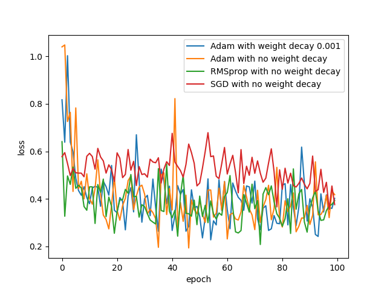
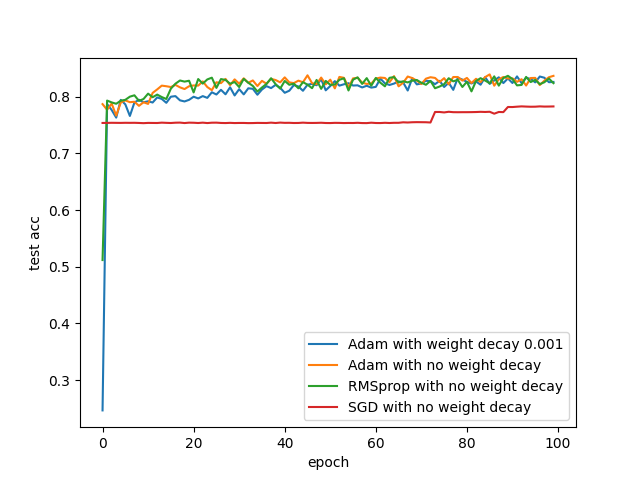

# Adult-Dataset-using-cnn
Adult Dataset using cnn
## Data set
Adult Dataset
Predict whether income exceeds $50K/yr based on census data.
http://archive.ics.uci.edu/ml/datasets/Adult
## Data preprocessing
A total of 48842 combining train and test.
3620 piece of data that consists of null value(get rid of directly)
0.25 split on the total data set
Train on 33916 pieces of data and test on 11306 pieces
## CNN architecture
1D CNN(4) and then fc layer(2) 
## Results
We compare L2 norm and without, Adam, SGD, and RMSprop. Graph shown below:

## note
Originally, I am using data preprocessing in https://github.com/saravrajavelu/Adult-Income-Analysis, but there seems to be some problem among it and loss keeps going to nan. I redo the preprocessing step and get the results.

